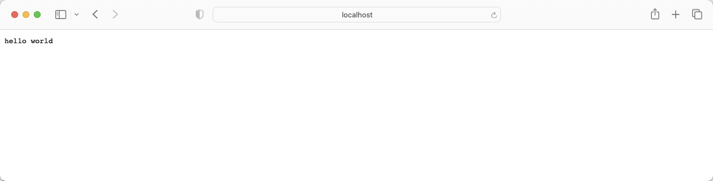

## net/http 实现一个简单的服务端程序

go 语言把 http 的服务端与客户端实现都放在了这一个模块，这里以写一个返回  hello world 的服务端程序为例子。

---

## 代码

```go

package main

import (
	"fmt"
	"net/http"
)

func main() {
    // 关联路径与请求处理函数
	http.HandleFunc("/", func(writer http.ResponseWriter, request *http.Request) {
        // 直接往输出里面写入 hello world 
		fmt.Fprintf(writer, "hello world")
	})
	http.ListenAndServe(":8080", nil)
}
```
---

## 效果



---

## 处理对象
处理程序不一定是函数，也可以是对象，只要它实现了 `ServeHTTP(w http.ResponseWriter, r *http.Request)` 就行。

```go

package main

import (
	"fmt"
	"net/http"
)

type HelloHandler struct{}

func (this *HelloHandler) ServeHTTP(w http.ResponseWriter, r *http.Request) {
	fmt.Fprintf(w, "hello world")
}

func main() {
	http.Handle("/", &HelloHandler{})
	http.ListenAndServe(":8080", nil)
}
```

---