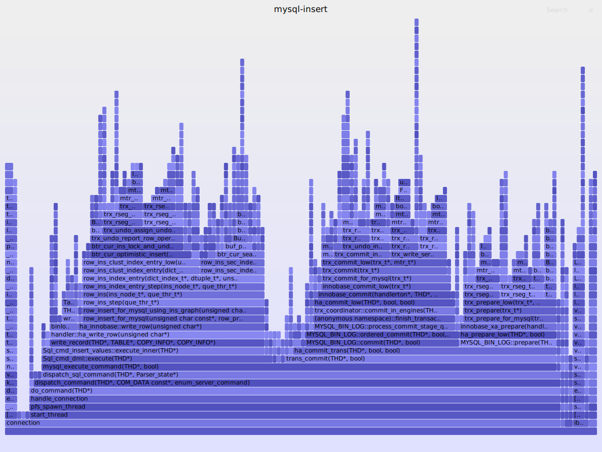

# dispatch_command

dispatch_command 函数的信息还是非常丰富的，thd 代表的是当前的连接，com_data 保存的是要执行的 sql ，command 这里里记录了 sql 的类型。它的关键部分如下

```c
bool dispatch_command(THD *thd, const COM_DATA *com_data,
                      enum enum_server_command command) {
    Parser_state parser_state;
    thd->set_query(beginning_of_next_stmt, length);
    dispatch_sql_command(thd, &parser_state);

}

union COM_DATA {
  COM_INIT_DB_DATA com_init_db;
  COM_REFRESH_DATA com_refresh;
  COM_KILL_DATA com_kill;
  COM_SET_OPTION_DATA com_set_option;
  COM_STMT_EXECUTE_DATA com_stmt_execute;
  COM_STMT_FETCH_DATA com_stmt_fetch;
  COM_STMT_SEND_LONG_DATA_DATA com_stmt_send_long_data;
  COM_STMT_PREPARE_DATA com_stmt_prepare;
  COM_STMT_CLOSE_DATA com_stmt_close;
  COM_STMT_RESET_DATA com_stmt_reset;
  COM_QUERY_DATA com_query;
  COM_FIELD_LIST_DATA com_field_list;
};

enum enum_server_command {
  /**
    Currently refused by the server. See ::dispatch_command.
    Also used internally to mark the start of a session.
  */
  COM_SLEEP,
  COM_QUIT,       /**< See @ref page_protocol_com_quit */
  COM_INIT_DB,    /**< See @ref page_protocol_com_init_db */
  COM_QUERY,      /**< See @ref page_protocol_com_query */

}
```

下面是一个典型的堆栈信息



---


## 实战
既然 dispatch_command 的第二个参数是 sql 语句，我们可以想办法把它打印出来。
```
#!/usr/bin/env bpftrace

BEGIN 
{
    print("mysql dispatch_command function trace \n");
    print("trhead-id    datetime    sql-stmt \n");
}

uprobe:/usr/local/mysql/bin/mysqld:*dispatch_command*
{
    if (arg2 == 3) {
        printf("%d    %s    %s\n", tid, strftime("%H:%M:%S.%f", nsecs), str(*arg1)); 
    } 
}

END
{
    print("exit \n")
}
```

我们在 mysql 上执行如下命令，看能不能追踪到 sql 查询

```
mysql> select * from mysql.user;
mysql> use tempdb;
```

bpftrace 观察到的效果如下

```
bpftrace /tmp/dis-trace.bt 

WARNING: Addrspace is not set
Attaching 9 probes...
mysql dispatch_command function trace 

trhead-id    datetime    sql-stmt 

4092918    17:12:16.684450    select * from mysql.user
4092918    17:12:24.868902    SELECT DATABASE()
4092918    17:12:24.870064    show databases
4092918    17:12:24.875404    show tables
```

比较有意思是 use xxx 它在后端对应的是好几个命令。

---


        