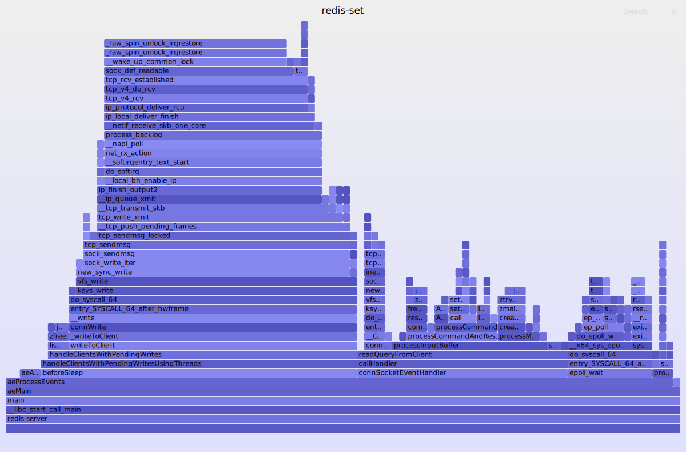

# set 的执行流程
追踪 redis `set name tom` 这类简单命令的执行流程。

---

## 场景
构建场景
```python
#!/usr/bin/env python3

import redis
import logging
import argparse

logging.basicConfig(level=logging.DEBUG)


def prepare_env():
    counter = 0
    with redis.Redis(host="127.0.0.1", port=6379, db=0) as r:
        for number in range(10000000000, 20000000000):
            r.add("test:key:name", number)
            if counter % 100 == 0:
                logging.info("current counter = {}".format(counter))

            # 执行到 100 万次的时候退出
            if counter >= 1000000:
                break

            counter = counter + 1


if __name__ == "__main__":
    parser = argparse.ArgumentParser()
    parser.add_argument("action", choices=["prepare"])
    args = parser.parse_args()

    if args.action == "prepare":
        prepare_env()
    else:
        print("not suport action")
```

运行脚本执行 100w 次 set 命令

```bash
python3 test-redis-set.py prepare
```

---

## 打火焰图
```
profile -p 3053477 -af 7 > /tmp/redis.stacks
./flamegraph.pl --color=io --title=redis-set < /tmp/redis.stacks > /tmp/redis-set.svg
```



从火焰图来看，真正执行 set 操作的应该是 setCommand 这个函数。

---

## bpftrace 取出堆栈
用 bpftrace 取一下堆栈，这样看执行流程更加方便一些，确认 setCommand 的 uprobe 路径。

```
bpftrace -l 'uprobe:/usr/local/redis/bin/redis-server:*' | grep setCommand

uprobe:/usr/local/redis/bin/redis-server:getsetCommand
uprobe:/usr/local/redis/bin/redis-server:hsetCommand
uprobe:/usr/local/redis/bin/redis-server:lsetCommand
uprobe:/usr/local/redis/bin/redis-server:msetCommand
uprobe:/usr/local/redis/bin/redis-server:resetCommand
uprobe:/usr/local/redis/bin/redis-server:resetCommandTableStats
uprobe:/usr/local/redis/bin/redis-server:setCommand                 # 结合火焰图，我们应该是要 trace 这个
```

---

```
#!/usr/bin/env bpftrace

BEGIN 
{
    print("redis set 堆栈分析 \n")
}

uprobe:/usr/local/redis/bin/redis-server:setCommand
{
    printf("%s\n", ustack(perf)); 
}

END
{
    print("exit \n")
}
```

执行效果

```
bpftrace trace.bt 
Attaching 3 probes...
redis set 堆栈分析 


	490fd5 setCommand+0 (/usr/local/redis-7.0.11-debug/bin/redis-server)
	452a90 processCommand+3492 (/usr/local/redis-7.0.11-debug/bin/redis-server)
	46c6d0 processCommandAndResetClient+53 (/usr/local/redis-7.0.11-debug/bin/redis-server)
	46c928 processInputBuffer+388 (/usr/local/redis-7.0.11-debug/bin/redis-server)
	46ce52 readQueryFromClient+1047 (/usr/local/redis-7.0.11-debug/bin/redis-server)
	533c52 callHandler+48 (/usr/local/redis-7.0.11-debug/bin/redis-server)
	534369 connSocketEventHandler+343 (/usr/local/redis-7.0.11-debug/bin/redis-server)
	4457dd aeProcessEvents+591 (/usr/local/redis-7.0.11-debug/bin/redis-server)
	4459da aeMain+42 (/usr/local/redis-7.0.11-debug/bin/redis-server)
	45ae98 main+2959 (/usr/local/redis-7.0.11-debug/bin/redis-server)
	7f2320a40440 __libc_start_call_main+128 (/usr/lib64/libc.so.6)
```

---
